<p align="center">
  
</p>

I look at where MCP clients and LLM coding agents hand trust to remote metadata
or local infrastructure with no human in the loop — and I harden it.

### Selected work

**[mcp-remote OAuth trust-boundary research](https://github.com/playb0t/mcp-remote-oauth-security)** · 7 advisories · coordinated disclosure

> **Reviewed surfaces** — resource metadata, authorization-server discovery,
> redirect handling, browser navigation, local credentials, and SSE transport.
>
> Public research release for `geelen/mcp-remote`, reviewed through `0.1.38`.
> Relevant ranges differ by advisory: two localhost-canary PoCs, three bounded
> source-review findings, and two defense-in-depth/correction records. No
> weaponized exploit code published.
>
> Corrective release → [`v1.0.1`](https://github.com/playb0t/mcp-remote-oauth-security/releases/tag/v1.0.1)

**[rtk-ai/rtk](https://github.com/rtk-ai/rtk)** · 74k★ · Rust command-proxy for coding agents

> **SHA-256 hook-integrity verification** - [PR #119](https://github.com/rtk-ai/rtk/pull/119), merged after security review.
>
> RTK's `PreToolUse` hook auto-approves every rewritten command, so any process
> running as the user - a malicious `postinstall`, a compromised dependency — can
> overwrite the hook and slip commands past the agent's permission prompt. I shipped
> the fail-closed integrity gate: a 525-line Rust module with a five-state
> verification machine, an `rtk verify` subcommand, read-only baseline hashes, and
> 14 unit tests. Tampered hook → RTK refuses to run.
>
> Writeup → [`rtk-hook-integrity`](https://github.com/playb0t/rtk-hook-integrity)

```python
interests = ["MCP/OAuth trust boundaries", "cryptographic architecture", "coordinated disclosure"]
```
