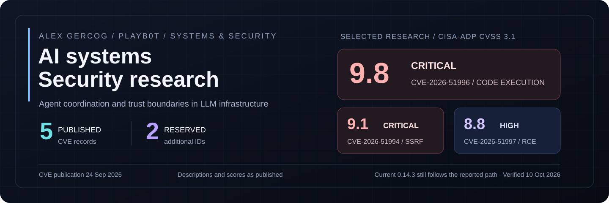

  

## AI security research at the point of execution

I investigate how MCP clients and coding agents turn remote metadata, OAuth
discovery and local automation into trusted actions.

**Five published CVE records reference my mcp-remote research. CISA-ADP rates
three of them 9.1 Critical, 8.8 High and 7.5 High.** The published MITRE CNA
descriptions cover SSRF, remote arbitrary code execution and sensitive
information disclosure.

[Research package](https://github.com/playb0t/mcp-remote-oauth-security)
· [Disclosure timeline](https://github.com/playb0t/mcp-remote-oauth-security/blob/v1.0.1/TIMELINE.md)
· [Research scope and corrections](https://github.com/playb0t/mcp-remote-oauth-security/blob/v1.0.1/CORRECTIONS.md)

### Published CVE records

MITRE CNA publication: **24 September 2026**. Status and score verification:
**28 September 2026**. Every record below directly links to a versioned advisory
in the research package.

| Official CVE record | Published MITRE CNA description | CISA-ADP CVSS 3.1 |
|---|---|---|
| [CVE-2026-51994](https://www.cve.org/CVERecord?id=CVE-2026-51994) | SSRF through the `resource_metadata` URL in a remote MCP server's `WWW-Authenticate` header | **9.1 · Critical** |
| [CVE-2026-51995](https://www.cve.org/CVERecord?id=CVE-2026-51995) | Remote disclosure of sensitive information through OAuth authorization-server metadata components | **7.5 · High** |
| [CVE-2026-51996](https://www.cve.org/CVERecord?id=CVE-2026-51996) | Arbitrary code execution by a remote attacker through `getServerUrlHash` | Not provided |
| [CVE-2026-51997](https://www.cve.org/CVERecord?id=CVE-2026-51997) | Arbitrary code execution by a remote attacker through `open()` | **8.8 · High** |
| [CVE-2026-52001](https://www.cve.org/CVERecord?id=CVE-2026-52001) | Remote disclosure of sensitive information through the SSE `eventSourceInit` fetch wrapper | Not provided |

Descriptions above are attributed to the published **MITRE CNA records**;
scores are **CISA-ADP assessments**, also displayed by NVD. Some official impact
descriptions exceed the independently demonstrated impact in the corrected
research. The [v1.0.1 scope and correction record](https://github.com/playb0t/mcp-remote-oauth-security/blob/v1.0.1/CORRECTIONS.md)
preserves those evidence limits.

<strong>Two additional coordinated IDs remain RESERVED</strong>

- [CVE-2026-51998](https://www.cve.org/CVERecord?id=CVE-2026-51998) — RESERVED.
- [CVE-2026-51999](https://www.cve.org/CVERecord?id=CVE-2026-51999) — RESERVED.

These IDs are not included in the five published records. Their publication
timing and final advisory mapping remain unresolved.

### The research

`mcp-remote` connects stdio-based MCP clients to remote servers and handles
OAuth discovery. The research follows the decisions that select request
destinations, launch a browser and move or persist credentials.

The public package contains **seven advisory records** with version-specific
scope, a disclosure timeline and remediation guidance. Its corrected evidence
classes remain explicit: two localhost-canary reproductions, three bounded
source reviews and two hardening/correction records.

**Public citation:** [playb0t — mcp-remote OAuth Trust-Boundary Security Advisories](https://github.com/playb0t/mcp-remote-oauth-security/blob/v1.0.1/CITATION.cff).

### Engineering contribution

**[rtk-ai/rtk — SHA-256 hook integrity](https://github.com/rtk-ai/rtk/pull/119)**

I contributed an integrity gate for local coding-agent hooks. A modified hook
fails verification instead of continuing through the trusted command path.
[PR #119](https://github.com/rtk-ai/rtk/pull/119) was merged; the
[technical writeup](https://github.com/playb0t/rtk-hook-integrity) documents the work.

### Focus

MCP and OAuth security · Agent execution boundaries · Adversarial testing ·
Cryptographic integrity · Coordinated disclosure
